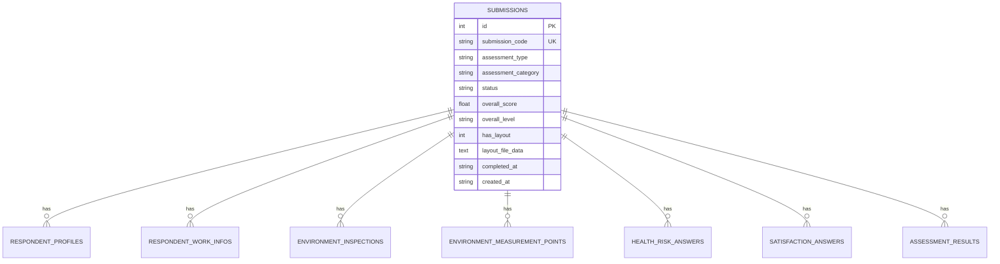

# PROJECT_OVERVIEW.md

# 🛡️ Save Check - ระบบประเมินสภาพแวดล้อมในการทำงาน ความเสี่ยงสุขภาพ และความพึงพอใจ

> **สถานะปัจจุบันของระบบ:** พัฒนาเสร็จสมบูรณ์ 100% พร้อมใช้งานบน Production (Cloudflare Pages + Workers + D1)

---

## 1. บทสรุปโครงการ (Project Summary)

**Save Check** คือ Web Application สำหรับประเมินความปลอดภัย อาชีวอนามัย และสภาพแวดล้อมในการทำงาน รองรับการตรวจวัดแบบละเอียด คำนวณตามเกณฑ์กฎหมายความปลอดภัยอัตโนมัติ พร้อมหน้ารายงานผล, ระบบพิมพ์ PDF, ฟังก์ชันแนบและจัดการผังพื้นที่ห้อง, ระบบส่งออกรายงาน Excel แบบแยก Sheet และระบบ Dashboard จัดการข้อมูลแบบ Server-Side Realtime

ระบบนี้ออกแบบเป็น **Assessment-first Web App แบบไม่มี Login** เพื่อให้ผู้ตรวจวัดหรือพนักงานสามารถเข้าใช้งานผ่านมือถือหรือคอมพิวเตอร์ได้สะดวกรวดเร็วผ่านลิงก์หรือสแกน QR Code

```text
[ Assessment-first Flow ]
เปิดหน้าแรก -> เลือกประเภทการประเมิน -> บันทึกข้อมูลและจุดตรวจวัด -> คำนวณผลตามเกณฑ์กฎหมาย -> แสดงหน้ารายงานผล / พิมพ์ PDF / จัดการบน Dashboard
```

---

## 2. เทคโนโลยีที่ใช้ (Tech Stack & Architecture)

| ส่วนประกอบ             | เทคโนโลยี / เครื่องมือ           | รายละเอียดการใช้งาน                                                             |
| ---------------------- | -------------------------------- | ------------------------------------------------------------------------------- |
| **Frontend Framework** | **Next.js 15 (App Router)**      | Static Export / Fast Client Navigation (`/dashboard`, `/result`, `/assessment`) |
| **Language**           | **TypeScript 5.8**               | Type-safe 100% ครอบคลุมทั้ง Frontend และ Worker Backend                         |
| **Styling & UI**       | **Tailwind CSS v4**              | Glassmorphism Theme, Mobile-first Responsive, Print Media Optimization          |
| **Form Management**    | **React Hook Form + Zod**        | Form Wizard State, Step Validation, LocalStorage Draft Cache                    |
| **Excel Export**       | **SheetJS (`xlsx`)**             | ส่งออกข้อมูล Multi-Sheet Workbook (.xlsx) 4 Sheet ฝั่ง Client                   |
| **Backend API**        | **Cloudflare Workers (Hono.js)** | Serverless REST API พร้อม CORS, Validation, Error Handling                      |
| **Database**           | **Cloudflare D1 (SQLite)**       | ฐานข้อมูล Relational 8 ตาราง พร้อม Foreign Keys & Cascade Delete                |
| **Package Manager**    | **Bun**                          | Runtime และ Package Manager ประสิทธิภาพสูง                                      |
| **Production Hosting** | **Cloudflare Pages + Workers**   | Edge Hosting ทั่วโลก (Live API & Frontend)                                      |

---

## 3. ฟีเจอร์ที่พัฒนาเสร็จสมบูรณ์ (Implemented Features)

### 3.1 🌿 ตรวจวัดสภาพแวดล้อมในการทำงาน (Environment Assessment)

- **แสงสว่าง (Light):** บันทึกจุดตรวจวัดหลายจุด (Multi-point) + เทียบค่ามาตรฐานความเข้มแสง (Lux) ตามประเภทพื้นที่ทำงาน (เช่น โต๊ะทำงาน, ทางเดิน, พื้นที่ผลิต)
- **เสียง (Noise):** บันทึกค่าระดับเสียงต่ำสุด (Min), สูงสุด (Max) และเฉลี่ย (Avg) ในหน่วย dBA + ประเมินเกณฑ์ความปลอดภัย 85 dBA
- **ความร้อน (Heat):** บันทึกอุณหภูมิกระเปาะแห้ง (Dry), กระเปาะเปียก (Wet), โกลบ (Globe) และคำนวณ **WBGT** อัตโนมัติ เทียบเกณฑ์ตามภาระงาน (เบา / ปานกลาง / หนัก)
- **ระบบผังพื้นที่ห้อง (Room Layout Management):**
  - รองรับการแนบไฟล์รูปภาพ (PNG, JPG, WebP) และเอกสาร PDF
  - **Staged Save Flow:** เลือกไฟล์แล้วต้องกดยืนยัน "บันทึกผังห้อง" ก่อนส่งเข้าฐานข้อมูล
  - **Fullscreen Lightbox Modal:** ดูภาพผังห้องขยายเต็มจอ 100vw × 100vh พร้อม Scroll Lock และปุ่มดาวน์โหลด
  - **Delete Layout Confirm:** Modal ยืนยันก่อนลบไฟล์ผังห้องออกจากระบบ

### 3.2 🩺 ประเมินความเสี่ยงสุขภาพ (Health Risk Assessment)

- **ข้อมูลผู้รับการตรวจ:** ชื่อ-นามสกุล, เพศ, อายุ, น้ำหนัก, ส่วนสูง, คำนวณค่า **BMI** อัตโนมัติ, โรคประจำตัว
- **ข้อมูลการทำงาน:** แผนก, ตำแหน่งงาน, ประสบการณ์การทำงาน, ชั่วโมงทำงานต่อวัน
- **แบบประเมิน 3 มิติ (10 ข้อ):**
  1. ด้านท่าทาง/การยศาสตร์ (Ergonomics & Posture)
  2. ด้านสิ่งแวดล้อม/สารเคมี (Physical & Chemical Factors)
  3. ด้านจิตใจ/ความเครียด (Psychosocial & Stress)
- **ประเมินผลความเสี่ยง:** คำนวณคะแนนรวมและจัดระดับความเสี่ยง (ผ่านเกณฑ์ / เสี่ยงปานกลาง / เสี่ยงสูง)

### 3.3 ⭐ ประเมินความพึงพอใจในการใช้งาน (Satisfaction Assessment)

- ประเมิน 4 มิติ: ความพร้อมสถานที่, สภาพแวดล้อมกายภาพ, ความปลอดภัย, การให้บริการ
- คำนวณคะแนนเฉลี่ยรวม (เต็ม 5.0 ดาว) และช่องกรอกข้อเสนอแนะเพิ่มเติม

### 3.4 📄 หน้ารายงานสรุปผลฉบับสมบูรณ์ (Result Page: `/result`)

- แสดงข้อมูลสรุปผลแบบ Interactive Status Badge, Progress Bar และตารางแจกแจงรายจุด
- **พิมพ์ / ดาวน์โหลดรายงาน (Print & PDF):** ปรับแต่ง Print CSS ให้พอดีหน้ากระดาษ ตัดเมนู UI ออก และแสดงผังห้องเฉพาะรายงานสภาพแวดล้อม
- **ลบรายการประเมิน (Delete Submission):** ปุ่มลบรายการคู่กับปุ่มพิมพ์ พร้อม Modal ยืนยัน และลบข้อมูลสัมพันธ์ทั้ง 8 ตารางใน DB แบบ Atomic Batch
- **Loading & Error Feedback:** Minimal Spinner Loading สบายตาขณะดึงข้อมูล

### 3.5 📊 หน้า Dashboard & Data Management (`/dashboard`)

- **KPI Summary Cards:** สรุปยอดรวมประเมิน, ตรวจสภาพแวดล้อม, ความเสี่ยงสุขภาพ, และความพึงพอใจเฉลี่ย
- **Server-Side Query API:** ส่งพารามิเตอร์ Query ตรงเข้า Cloudflare Worker & D1 DB
  - ค้นหารหัส, ชื่อผู้ตรวจ, สถานที่ (Debounce 350ms)
  - กรองประเภทการประเมิน
  - สลับการเรียงลำดับเวลา (ล่าสุด / เก่าสุด)
  - แบ่งหน้า (Pagination) จากฐานข้อมูลจริง
- **Date Range Filter & Quick Presets:** กรองตามช่วงเวลา "ทั้งหมด", "วันนี้", "7 วันล่าสุด", "30 วันล่าสุด" หรือเลือกวันที่เริ่มต้น - สิ้นสุดเอง
- **ส่งออกรายงาน Excel (Multi-Sheet .xlsx):** ส่งออก 4 Sheet ในไฟล์เดียว (ภาพรวม, สภาพแวดล้อม, ความเสี่ยงสุขภาพ, ความพึงพอใจ) ตรงตามตัวกรองที่เลือกในตาราง

---

## 4. โครงสร้างโปรเจกต์ (Project Directory Structure)

```text
save-check/
├── public/                      # Static assets และรูปภาพ
├── src/
│   ├── app/                     # Next.js App Router (Pages & Layouts)
│   │   ├── layout.tsx           # Root Layout & Navigation Bar
│   │   ├── page.tsx             # หน้าแรก (Home Cards เลือกประเภทประเมิน)
│   │   ├── dashboard/page.tsx   # หน้า Dashboard สรุปผลและตารางประวัติ
│   │   ├── result/page.tsx      # หน้ารายงานผลการประเมิน (พิมพ์/ลบ/ดูผัง)
│   │   ├── assessment/page.tsx  # หน้าทำแบบประเมิน (Multi-step Wizard)
│   │   ├── category/page.tsx    # หน้าเลือกหมวดหมู่สภาพแวดล้อม (แสง/เสียง/ความร้อน)
│   │   └── globals.css          # Design Tokens, Glassmorphism, Print Styles
│   ├── components/              # UI Components แยกตามโมดูล
│   │   ├── assessment/          # Steps ฟอร์มประเมิน (Environment, Health, Satisfaction)
│   │   ├── dashboard/           # AssessmentDataTable, Filters, Export Button
│   │   ├── forms/               # Input, Radio, Checkbox, Slider, FileUpload
│   │   ├── layout/              # PageHeader, BottomNav, CreditsModal
│   │   └── ui/                  # Badge, Card, Modal, ImageLightboxModal
│   ├── lib/                     # Utilities & Business Logic
│   │   ├── api.ts               # API Client ฟังก์ชันยิงเข้า Cloudflare Worker
│   │   ├── constants.ts         # ค่าคงที่ Labels, Routes, Options
│   │   ├── environment-schema.ts# เกณฑ์มาตรฐานกฎหมาย & WBGT Calculation
│   │   ├── excel-export.ts      # Multi-Sheet Excel (.xlsx) Generator
│   │   ├── health-risk-data.ts  # ชุดคำถามและเกณฑ์คำนวณความเสี่ยงสุขภาพ
│   │   ├── schemas.ts           # Zod Schema Validation
│   │   └── utils.ts             # จัดรูปแบบวันที่ไทย, Submission Code Generator
│   └── types/                   # TypeScript Interfaces & Types ทั้งระบบ
│       └── index.ts
├── worker/                      # Cloudflare Workers Backend API
│   ├── src/
│   │   ├── db/
│   │   │   ├── schema.sql       # โครงสร้างฐานข้อมูล D1 (8 ตาราง)
│   │   │   └── seed.sql         # ข้อมูลจำลองสำหรับทดสอบ
│   │   ├── routes/
│   │   │   ├── submissions.ts   # API บันทึก/อัปเดตผังห้อง/ลบข้อมูล
│   │   │   ├── results.ts       # API ดึงผลประเมินรายรหัส
│   │   │   └── dashboard.ts     # API Summary, Query Submissions, Export Data
│   │   ├── index.ts             # Hono App Entry, CORS & Error Handlers
│   │   └── types.ts             # Worker Env Bindings & Types
│   ├── wrangler.toml            # Cloudflare Worker & D1 Database Config
│   └── package.json
└── package.json                 # Frontend Dependencies & Scripts
```

---

## 5. โครงสร้างฐานข้อมูล Cloudflare D1 (8 Tables)



1. **`submissions`**: ตารางหัวเอกสารหลัก (รหัส `SUB-...`, ประเภท, หมวดหมู่, ผลรวม, ผังห้อง, วันที่)
2. **`environment_inspections`**: ข้อมูลผู้ตรวจวัด, ตำแหน่ง, สถานที่, อุปกรณ์, เวลาตรวจ
3. **`environment_measurement_points`**: จุดตรวจวัดสภาพแวดล้อมละเอียด (Lux / dBA Min-Max-Avg / WBGT Dry-Wet-Globe)
4. **`respondent_profiles`**: ข้อมูลส่วนบุคคล (เพศ, อายุ, น้ำหนัก, ส่วนสูง, โรคประจำตัว)
5. **`respondent_work_infos`**: ข้อมูลการทำงาน (แผนก, ตำแหน่ง, ประสบการณ์, ชั่วโมงงาน)
6. **`health_risk_answers`**: คำตอบแบบประเมินความเสี่ยงสุขภาพรายข้อ
7. **`satisfaction_answers`**: คะแนนประเมินความพึงพอใจรายมิติและข้อเสนอแนะ
8. **`assessment_results`**: แคชผลการคำนวณและข้อเสนอแนะความปลอดภัย

---

## 6. รายการ API Endpoints (Cloudflare Worker)

**Live Production API:** `https://save-check-api.ameenahroya.workers.dev`  
**Local Development:** `http://localhost:8787`

| Method   | Endpoint                        | คำอธิบาย                                                                                              |
| -------- | ------------------------------- | ----------------------------------------------------------------------------------------------------- |
| `POST`   | `/api/submissions`              | บันทึกผลการประเมินใหม่เข้าฐานข้อมูลสัมพันธ์ 8 ตาราง                                                   |
| `GET`    | `/api/results/:code`            | ดึงข้อมูลผลการประเมินฉบับสมบูรณ์ตามรหัส `submission_code`                                             |
| `PATCH`  | `/api/submissions/:code/layout` | บันทึก/แก้ไข/ลบไฟล์ผังพื้นที่ห้อง (Room Layout)                                                       |
| `DELETE` | `/api/submissions/:code`        | ลบประวัติการประเมินและความสัมพันธ์ทั้งหมดใน DB (Atomic Batch)                                         |
| `GET`    | `/api/dashboard/summary`        | สรุปยอดรวม KPI, แยกประเภท, แยกผลประเมิน, และคะแนนเฉลี่ย                                               |
| `GET`    | `/api/dashboard/submissions`    | Query ตารางประวัติ (รองรับ `search`, `type`, `start_date`, `end_date`, `sort_order`, `page`, `limit`) |
| `GET`    | `/api/dashboard/export-data`    | ดึงข้อมูลความสัมพันธ์ทั้งหมดสำหรับแปลงเป็น Excel Multi-Sheet                                          |

---

## 7. คู่มือคำสั่งสำหรับพัฒนาและใช้งานต่อ (Developer Guide)

### 7.1 ติดตั้ง Dependencies

```bash
# ติดตั้ง Frontend
bun install

# ติดตั้ง Backend Worker
cd worker && bun install && cd ..
```

### 7.2 รัน Development Server

```bash
# Terminal 1: รัน Next.js Frontend (http://localhost:3000)
bun run dev

# Terminal 2: รัน Cloudflare Worker API (http://localhost:8787)
cd worker && bun run dev
```

### 7.3 คำสั่งจัดการฐานข้อมูล D1

```bash
# รัน Migration ในเครื่อง
bun run db:migrate

# เพิ่มข้อมูล Seed ทดสอบในเครื่อง
bun run db:seed

# ล้างข้อมูลทั้งหมดในเครื่อง (ไม่ลบตาราง)
bun run db:truncate

# รัน Migration ขึ้น Cloudflare D1 Production
bun run db:migrate:remote

# ล้างข้อมูลทั้งหมดบน Cloudflare D1 Production (ไม่ลบตาราง)
bun run db:truncate:remote
```

### 7.4 คำสั่งสำหรับแก้ไขและ Deploy หลังบ้าน (Backend & Database)

#### 🔸 แบบที่ 1: รันจากโฟลเดอร์หลัก (`/save-check/`)
```bash
# กรณีแก้เฉพาะโค้ด API:
bunx wrangler deploy --config worker/wrangler.toml

# กรณีแก้ไขโครงสร้าง Database ด้วย:
bun run db:migrate:remote
bunx wrangler deploy --config worker/wrangler.toml
```

#### 🔸 แบบที่ 2: รันจากข้างในโฟลเดอร์ Worker (`/save-check/worker/`)
```bash
# 1. อัปเดต Database ขึ้น Cloudflare D1
bunx wrangler d1 execute save-check-db --remote --file=./src/db/schema.sql

# 2. Deploy API ขึ้น Cloudflare Workers
bunx wrangler deploy
```

---

### 7.5 Build & Deploy หน้าบ้าน (Frontend)

```bash
# ตรวจสอบ Typescript
bun run tsc --noEmit

# Build Static Export สำหรับ Cloudflare Pages (ได้โฟลเดอร์ out/)
bun run build

# (ตัวเลือก) Deploy Frontend ตรงขึ้น Cloudflare Pages ผ่าน CLI
bunx wrangler pages deploy out --project-name=save-check
```

